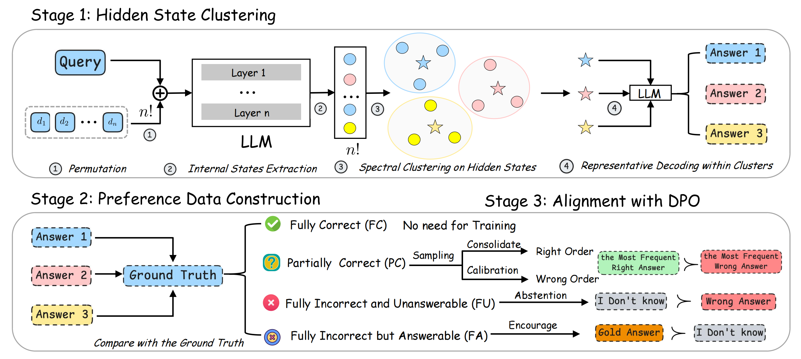

# Architecture



This is the repository for the paper: **Stable-RAG: Mitigating Retrieval-Permutation-Induced Hallucinations in Retrieval-Augmented Generation**.

## Updates


- 🎉 2026-04-06: Stable-RAG is accepted to ACL 2026 Main!

- 🚀 2026-01-10: Initial release of codes


Our code, datasets, and model weights will be made publicly available upon acceptance.


## Content
1. [Installation](#installation)
2. [Datasets](#datasets)
3. [Data Construction](#data-construction)
4. [Training](#training)
5. [Inference](#inference)
6. [FAQ](#faq)
7. [Citation](#citation)


## Installation

```shell
conda create -n StableRAG python=3.10
conda activate StableRAG
pip install -r requirements.txt
```


## Datasets


Due to storage limitations and double-blind review requirements, the three QA datasets are available from public sources. Retrieved documents can be obtained using [Self-RAG](https://github.com/AkariAsai/self-rag#:~:text=at%20Inference.-,Retriever%20Setup,-By%20default%2C%20we). 


## Data Construction

This section explains how to construct the training data for Stable-RAG, including representative decoding, intermediate data processing, and generating DPO-formatted training data.


Before running the scripts, set the input/output paths and model path. For example:

```shell
export INPUT_FILE="path/to/your/input.json"      # Input JSON file with questions and documents
export OUTPUT_FILE="path/to/your/output.json"    # Output file for cluster decoding results
export MODEL_PATH="path/to/your/llama_or_qwen_model"  # Path to your pre-trained LLM
```

1. Representative Decoding within Clusters
Run representative decoding to process documents and generate cluster-level answers:
```shell
python Stable-RAG/data_construction/representative_decoding.py \
    --input "$INPUT_FILE" \
    --output "$OUTPUT_FILE" \
    --model "$MODEL_PATH"
```

2. Generate Intermediate Data
Process the representative decoding results to generate intermediate JSON data:
```shell
python Stable-RAG/data_construction/get_data.py
```

3. Prepare DPO Training Data
Finally, generate the DPO-formatted training data for model fine-tuning:

```shell
python Stable-RAG/data_construction/get_dpo_data.py
```

## Training

This section describes how to fine-tune Stable-RAG using Direct Preference Optimization (DPO), including hyperparameters and example training commands.

### Training Environment

- Two NVIDIA RTX PRO 6000 GPUs
- LLaMA-3-8B-Instruct and Qwen3-8B as backbone models
- HuggingFace Transformers and TRL libraries
- LoRA (Low-Rank Adaptation) for parameter-efficient fine-tuning

### Example Hyperparameters

| Hyperparameter | Description | Value |
|----------------|------------|-------|
| Batch Size per GPU | Training batch size per device | 2 |
| Gradient Accumulation | Number of gradient accumulation steps | 8 |
| Learning Rate | Initial learning rate | 5e-6 |
| Warmup Ratio | Linear learning rate warmup ratio | 0.1 |
| LoRA Rank (r) | LoRA decomposition rank | 128 |
| LoRA Alpha | LoRA scaling factor | 128 |
| LoRA Dropout | LoRA dropout | 0 |
| Preference Scaling (β) | LLaMA3/Qwen3 | 0.4/0.3 |
| Number of Epochs | LLaMA-3-8B / Qwen3-8B | 1 / 2 |
| Time per Epoch | Approximate training time per epoch | ~2 hours |

> Note: The reference model is kept in evaluation mode to provide stable policy targets. A fixed random seed of 42 is used to ensure reproducibility.

### Example Training Command

```bash
bash Stable-RAG/bash/train_dpo.sh
```


## Inference 
We adopt Substring Exact Match (SubEM) and F1 for evaluation. SubEM checks whether the gold answer appears as a substring in the prediction, while F1 measures token-level overlap with the reference.

```shell
bash  Stable-RAG/bash/inference.sh
```


## FAQ

❓ What is the data construction cost of Stable-RAG?


- Overall cost:
In practice, the data construction cost of Stable-RAG is moderate and manageable.

- Representative Decoding within Clusters:
Using two NVIDIA RTX PRO 6000 GPUs, we can construct approximately 18,000 training samples within 24 hours, which matches the full data scale required for training in our experiments.

- Exhaustive Full-Permutation Decoding:
Exhaustive decoding over all document permutations requires approximately 3× the decoding time compared to representative decoding, due to the increased number of forward passes.


❓ What is the training cost of Stable-RAG?

Training is conducted on two NVIDIA RTX PRO 6000 GPUs. Each epoch takes roughly 2 hours. LLaMA-3-8B-Instruct is trained for 1 epoch, Qwen3-8B for 2 epochs. Therefore, the overall training cost is relatively low.

❓ Could the variations in Stable-RAG outputs be caused by sampling randomness?

No. During our data construction, we use greedy decoding. During inference, the generation temperature is set to 0.01, which is almost equivalent to greedy decoding. This ensures that output variations primarily reflect document-order sensitivity rather than sampling randomness.

## Citation
If you feel this project is helpful, please consider cite our paper😊.

```
@article{zhang2026stable,
  title={Stable-RAG: Mitigating Retrieval-Permutation-Induced Hallucinations in Retrieval-Augmented Generation},
  author={Zhang, Qianchi and Zhang, Hainan and Pang, Liang and Zheng, Hongwei and Zheng, Zhiming},
  journal={arXiv preprint arXiv:2601.02993},
  year={2026}
}
```